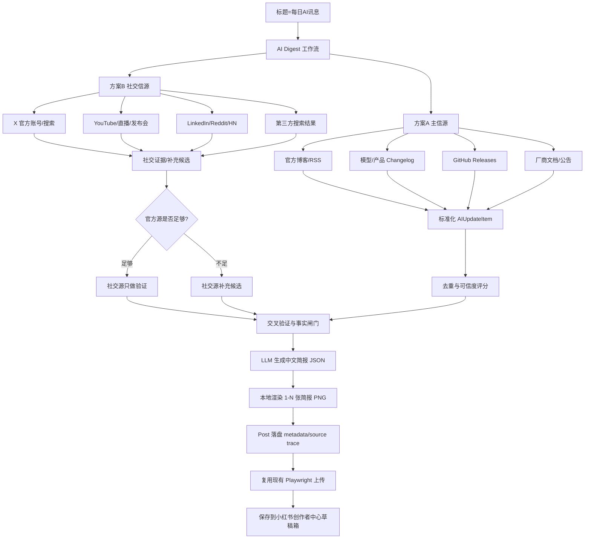

# 每日AI讯息设计方案（2026-06-30）

## 目标

当标题为 `每日AI讯息` 时，程序自动采集 AI 平台、软件、厂商和开源项目的当天动态，生成约 10 条中文简报，并根据内容长度自适应渲染 1-N 张小红书图文简报图片，最后复用现有 Playwright 链路保存到小红书创作者中心草稿箱。

## 设计原则

- 官方源优先：官方博客、RSS、changelog、GitHub Releases、厂商公告是主信源。
- 社交源补充：X、YouTube、LinkedIn、Reddit/HN、搜索结果只在官方源不足时补齐，或作为官方源的验证证据。
- 可追溯：每条动态保存原始链接、来源、发布时间、抓取时间、证据链接和可信度评分。
- 可扩展：新增信源只需要加配置和 fetcher，不改主流程。
- 稳定生成：简报图片用本地模板渲染，不依赖 AI 直接生成带文字图片，避免中文错字和排版不可控。

## 概念图

## 数据模型

`AIUpdateItem`：

- `title`
- `summary`
- `source_name`
- `source_type`: `official` / `social` / `search` / `github`
- `url`
- `published_at`
- `vendor`
- `product`
- `raw_excerpt`
- `confidence_score`
- `verification_status`: `official_only` / `social_confirmed` / `social_only` / `rejected`
- `evidence_urls`
- `tags`

`AIDigestBrief`：

- `title`
- `subtitle`
- `date`
- `items`
- `source_summary`
- `generated_at`

## 信源策略

首版主信源：

- OpenAI News / RSS
- Anthropic News
- Google DeepMind Blog
- Meta AI Blog
- Microsoft AI Blog
- NVIDIA AI Blog
- Hugging Face Blog
- GitHub Changelog / Releases
- 阿里云百炼 / 通义千问相关公告

首版社交源：

- X 公开账号页/搜索页或搜索引擎结果
- Hacker News / Reddit AI 相关讨论
- YouTube 官方发布视频

社交源默认不会替代官方源。只有当官方源少于 `AI_DIGEST_MIN_ITEMS` 时，才允许 `social_only` 候选补位；否则社交源只用于增加证据和热度判断。

## 图片策略

简报图根据动态长度自适应分页：

- 目标动态数量：约 10 条，可用 `AI_DIGEST_TARGET_ITEMS` 配置。
- 每张图片最多放 2-4 条，按每条摘要长度估算。
- 默认竖图尺寸：`1104x1472`。
- 图片数量上限：18 张，遵守小红书图文限制。
- 每张图底部保留来源说明，长 URL 不写入图片正文，只保存在本地 metadata。

## 工作流入口

- CLI：`auto --title 每日AI讯息 --count 1`
- GUI：自动发帖页增加快捷按钮 `每日AI讯息`
- 落盘：`post.platform.ai_digest`
- 图片：`data/posts/<post_id>/assets/ai_digest_*.png`

## 失败处理

- 主信源失败：继续尝试其它官方源。
- 官方源不足：启用社交源补齐。
- 社交源不可用：只用官方源生成，若仍不足则输出阶段化错误。
- LLM 失败：使用本地兜底模板生成摘要。
- 图片渲染失败：标记 `stage=简报图渲染`。
- 上传失败：复用现有 `stage=上传`。

## 测试策略

- 数据模型和去重排序使用本地 fixture，不联网。
- RSS/GitHub/X 搜索解析器使用 HTML/XML fixture。
- 简报图片渲染测试检查 PNG 文件存在、数量随内容长度变化、尺寸正确。
- 工作流测试 monkeypatch 掉网络和 LLM，验证 `每日AI讯息` 能生成 Post、assets 和 metadata。
- CLI/GUI 测试验证标题快捷入口和命令构造。
