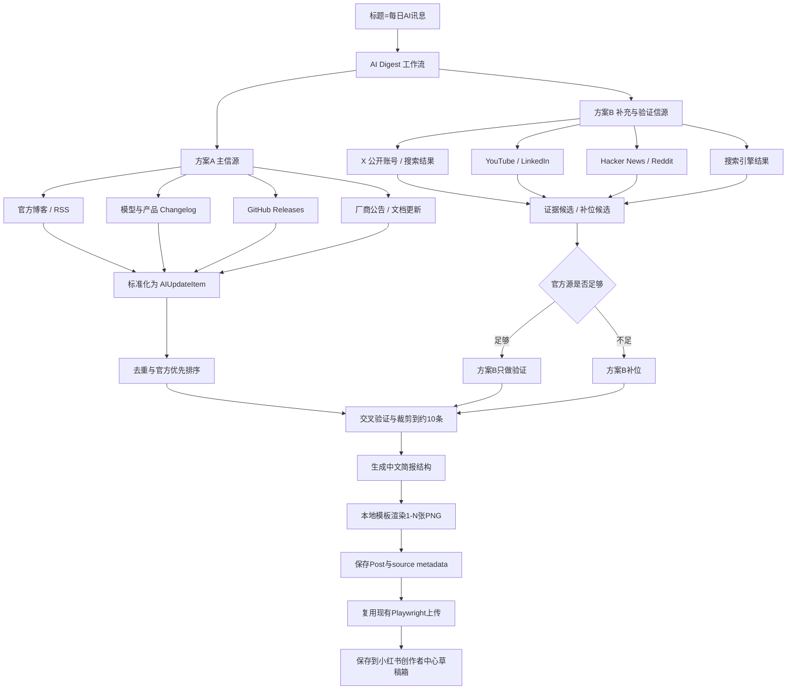

# 每日AI讯息功能说明（2026-06-30）

## 目标

当标题为 `每日AI讯息` 时，程序自动采集 AI 平台、软件、厂商和开源项目的公开动态，生成 1 条小红书图文草稿。草稿中包含约 10 条 AI 动态，图片由本地模板渲染为 1104x1472 的简报图，可根据内容长度自动拆分为多张图。

## 方案 A / 方案 B 合并策略

- 方案 A 是主信源：官方博客、RSS、模型或产品 changelog、GitHub Releases、厂商公告。
- 方案 B 是补充和验证信源：X 公开账号或搜索结果、Hacker News、Reddit、YouTube、LinkedIn、第三方搜索结果等。
- 当方案 A 当天动态数量足够时，方案 B 不替代官方源，只用于补充证据和交叉验证。
- 当方案 A 当天动态不足时，方案 B 允许补位，但会标记为 `social_only` 或 `search`，并在本地 metadata 保留证据链接。
- 所有条目进入统一数据模型 `AIUpdateItem`，再经过 URL/标题去重、官方优先排序、验证状态标记和数量裁剪。

## 概念图

PNG 版概念图：`docs/assets/daily_ai_digest_concept_2026-06-30.png`



## CLI / GUI 用法

命令行：

```powershell
$env:AI_DIGEST_TARGET_ITEMS="10"
$env:AI_DIGEST_MIN_OFFICIAL_ITEMS="6"
.\.venv\Scripts\python.exe -m apps.cli auto --title "每日AI讯息" --assets-glob "assets/empty/*" --count 1 --login-hold 600 --wait-timeout 600 --force
```

GUI：

- 打开 `.\AutoRedbookGUI-Launcher.exe` 或运行 `.\.venv\Scripts\python.exe -m apps.gui`。
- 在自动发帖页点击快捷标题 `每日AI讯息`。
- 选择上传模式、login-hold、wait-timeout 等通用参数。
- 运行后会调用 CLI 专用分支，固定生成 1 条简报草稿；动态数量由 `AI_DIGEST_TARGET_ITEMS` 控制。

## 可扩展配置

- `AI_DIGEST_TARGET_ITEMS`：目标动态数量，默认 `10`，建议保持 8-12。
- `AI_DIGEST_MIN_OFFICIAL_ITEMS`：官方源最低数量，默认 `6`；不足时启用补充源补位。
- `AI_DIGEST_PRIMARY_SOURCES`：主信源 allowlist，逗号分隔 source id。
- `AI_DIGEST_SOCIAL_SOURCES`：补充/验证信源 allowlist，逗号分隔 source id。

## 当前内置国内 AI 模型信源

| source id | 厂商/模型 | 类型 | 官方页面 |
| --- | --- | --- | --- |
| `aliyun` | 阿里云百炼 / 通义 | 官方发布说明 | `https://help.aliyun.com/zh/model-studio/release-notes` |
| `zhipu-glm` | 智谱 GLM | 官方新品发布 | `https://docs.bigmodel.cn/cn/update/new-releases` |
| `minimax` | MiniMax | 官方模型 Release Notes | `https://platform.minimax.io/docs/release-notes/models` |
| `doubao` | 火山方舟 / 豆包 | 官方模型发布公告 | `https://www.volcengine.com/docs/82379/1159178` |
| `baidu-qianfan` | 百度千帆 / 文心 | 官方模型更新记录 | `https://cloud.baidu.com/doc/qianfan/s/Kmh4stnjp` |
| `moonshot-kimi` | 月之暗面 Kimi | 官方公告博客 | `https://platform.moonshot.cn/blog/tags/announcement` |

新增官方博客或信源时，优先在 `src/ai_digest/sources.py` 增加 source 配置；如果是 RSS/GitHub Releases/普通 HTML 搜索页，复用 `src/ai_digest/fetchers.py` 中已有解析器。新协议或特殊页面再新增 fetcher，并补对应测试。

## 落盘与追溯

生成后的本地 post 会写入：

- `data/posts/<post_id>/post.json`
- `data/posts/<post_id>/assets/ai_digest_*.png`
- `post.platform.ai_digest.items`
- `post.platform.ai_digest.source_meta`

每条动态保留来源名称、来源类型、原始 URL、发布时间、验证状态和证据 URL。小红书正文和简报图不展示长 URL，避免影响阅读，但本地可以追溯源头。

## 本轮测试

- `tests/test_ai_digest.py`：数据模型、去重、官方优先、社交验证和目标数量。
- `tests/test_ai_digest_sources.py`：默认信源配置、RSS、GitHub Releases 和社交搜索 HTML fixture 解析。
- `tests/test_ai_digest_collect.py`：官方源不足时启用补充源，官方源足够时跳过补充抓取。
- `tests/test_ai_digest_generate.py`：简报提示词、JSON 解析、本地兜底简报和正文渲染。
- `tests/test_ai_digest_render.py`：PNG 渲染、尺寸和长内容自动分页。
- `tests/test_ai_digest_workflow.py`：标题 `每日AI讯息` 走专用 workflow 并落盘图片与 metadata。
- `tests/test_cli_ai_digest.py`：CLI `create/auto` 对 `每日AI讯息` 固定生成 1 条简报草稿，不按 `--count` 重复生成。
- `tests/test_gui.py`：GUI 快捷标题按钮和命令参数构造。
