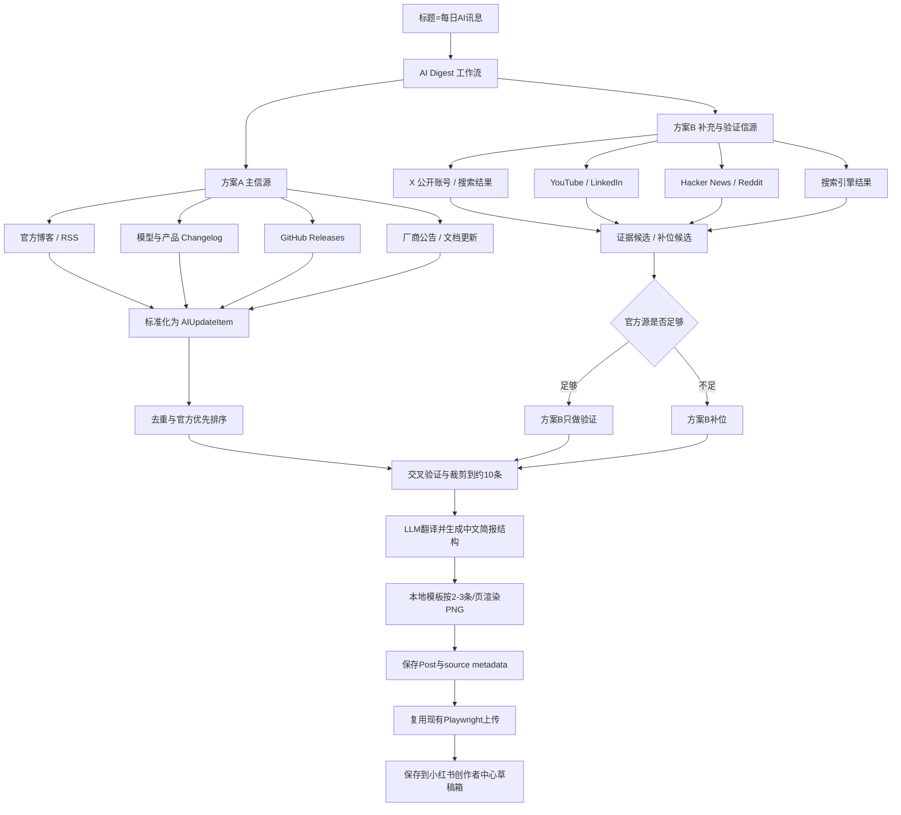

# 每日AI讯息功能说明（2026-06-30）

## 目标

当标题为 `每日AI讯息` 时，程序自动采集 AI 平台、软件、厂商和开源项目的公开动态，生成 1 条小红书图文草稿。草稿只使用北京时间发帖日、昨天、前天这 3 个自然日内的可追溯动态；实际条数由合格候选决定，不强行凑满 10 条。图片由本地模板渲染为 1104x1472 的简报图；内容页固定按 2-3 条动态分页，并按条数自动拉伸卡片高度，避免单页内容过少导致页面空白。封面会展示本期最新日期中优先级最高的一条技术/模型类 AI 动态，不再显示固定英文标题或“本期整理 N 条动态”胶囊。

## 方案 A / 方案 B 合并策略

- 方案 A 是主信源：官方博客、RSS、模型或产品 changelog、GitHub Releases、厂商公告。
- 方案 B 是补充和验证信源：X 公开账号或搜索结果、Hacker News、Reddit、YouTube、LinkedIn、第三方搜索结果等。
- 当方案 A 当天动态数量足够时，方案 B 不替代官方源，只用于补充证据和交叉验证。
- 当方案 A 当天动态不足时，方案 B 允许补位，但会标记为 `social_only` 或 `search`，并在本地 metadata 保留证据链接。
- 所有条目进入统一数据模型 `AIUpdateItem`，再经过 URL/标题/语义主题去重、官方优先、北京时间新近优先、技术/模型类型优先、厂商/模型来源轮选、验证状态标记和数量裁剪。
- 同一批官方源足够时，排序不会让单个厂商 RSS 占满全部条目；程序会在保留发布时间优先级的基础上按 vendor/source 轮选，尽量覆盖 OpenAI、DeepMind、Mistral、Qwen、GLM、豆包、DeepSeek 等不同来源。Hugging Face 属于综合发布兜底源，只有官方源、AI HOT 和搜索补充仍不足时才启用。
- 普通 HTML 发布页会过滤用户指南、计费说明、服务协议、监控告警、默认参数等文档导航噪声，减少把说明页标题误当作 AI 动态。

## 概念图

PNG 版概念图：`docs/assets/daily_ai_digest_concept_2026-06-30.png`



## CLI / GUI 用法

命令行：

```powershell
$env:AI_DIGEST_TARGET_ITEMS="20"
$env:AI_DIGEST_CANDIDATE_POOL_FACTOR="3"
$env:AI_DIGEST_MIN_OFFICIAL_ITEMS="6"
$env:AI_DIGEST_MAX_AGE_DAYS="3"
.\.venv\Scripts\python.exe -m apps.cli auto --title "每日AI讯息" --assets-glob "assets/empty/*" --count 1 --login-hold 600 --wait-timeout 600 --force
```

GUI：

- 打开 `.\AutoRedbookGUI-Launcher.exe` 或运行 `.\.venv\Scripts\python.exe -m apps.gui`。
- 在自动发帖页点击快捷标题 `每日AI讯息`。
- 选择上传模式、login-hold、wait-timeout 等通用参数。
- 运行后会调用 CLI 专用分支，固定生成 1 条简报草稿；动态数量由 `AI_DIGEST_TARGET_ITEMS` 控制上限。

## 可扩展配置

- `AI_DIGEST_TARGET_ITEMS`：动态数量上限，默认 `20`，不足时不会用旧消息硬凑。
- `AI_DIGEST_CANDIDATE_POOL_FACTOR`：候选池倍率，默认 `3`；生成上限为 `x` 时，会先从约 `3x` 条排序候选中去重再选择。
- `AI_DIGEST_MIN_OFFICIAL_ITEMS`：官方源最低数量，默认 `6`；不足时启用补充源补位。
- `AI_DIGEST_MAX_AGE_DAYS`：北京时间自然日窗口，默认 `3`，即发帖日当天、昨天、前天；超过窗口或缺少来源链接的候选会被直接舍弃。
- `AI_DIGEST_PRIMARY_SOURCES`：主信源 allowlist，逗号分隔 source id。
- `AI_DIGEST_SOCIAL_SOURCES`：补充/验证信源 allowlist，逗号分隔 source id。
- `AI_DIGEST_AGGREGATOR_SOURCES`：综合兜底信源 allowlist，默认 `huggingface,github-ai`，只在官方源和补充源不足时启用。

## 中文化与版式规则

- 程序会优先调用当前 LLM 配置，将英文、日文或其他语言的候选动态翻译并改写为自然中文。
- LLM 提示词要求只使用候选数据，不得补充未提供事实；公司名、模型名、产品名、API、GitHub 等专有名词可以保留原文。
- 如果 LLM 不可用、额度不足或返回格式异常，程序会回退到本地中文兜底摘要，并在 `post.platform.ai_digest.llm_error` 记录原因。
- 如果 LLM 或本地兜底产出 `某某发布AI动态` 这类空泛标题，系统会从原始候选标题、摘要和摘录中恢复模型/工具名和具体更新点，避免把无内容的泛化句写进图片。
- 入选前会硬过滤发布时间不在北京时间发帖日/昨天/前天范围内的候选；例如生成 2026-07-02 草稿时，`2026-01-05` 这类旧消息不会进入简报。
- 同一模型、基准、产品或版本的多篇链接会做语义去重；例如 `GeneBench-Pro` 的介绍页和案例页只保留一条，并把另一条链接放入证据 URL。
- 封面 `今日重点` 从最新北京时间日期里选择优先级最高的一条；后续内容页先按北京时间日期，再按类型优先级、关注度和来源多样性排列。
- 类型优先级：模型发布/版本升级、API/开发者工具、评测基准、开源项目、基础设施技术更新优先；观点探讨、趋势评论、采用案例作为补充。
- 每张内容图放 2-3 条 AI 讯息；例如 10 条动态会渲染为 1 张封面 + 4 张内容图，内容分组为 `3 / 3 / 2 / 2`。
- 内容页会根据当前页条数计算卡片高度：2 条时使用更高卡片，3 条时压缩摘要行数，保证版面尽量占满整页。
- 每条内容卡都会显示 `发布时间`、`来源` 和验证状态；底部不再显示“来源链接已保存至本地 metadata”或“长链接不写入图片”。
- 草稿正文会追加候选池筛选数量和 `来源链接` 列表，每条入选 AI 讯息都在正文中给出对应链接；图片仍不展示长 URL。
- 保存到小红书草稿箱后，若页面内联草稿箱按钮不可用，校验流程会重新进入发布页并打开草稿箱列表，以标题和封面状态确认 `saved_draft`。

## 当前内置国内 AI 模型信源

| source id | 厂商/模型 | 类型 | 官方页面 |
| --- | --- | --- | --- |
| `aliyun` | 阿里云百炼 / 通义 | 官方发布说明 | `https://help.aliyun.com/zh/model-studio/release-notes` |
| `zhipu-glm` | 智谱 GLM | 官方新品发布 | `https://docs.bigmodel.cn/cn/update/new-releases` |
| `minimax` | MiniMax | 官方模型 Release Notes | `https://platform.minimax.io/docs/release-notes/models` |
| `doubao` | 火山方舟 / 豆包 | 官方模型发布公告 | `https://www.volcengine.com/docs/82379/1159178` |
| `baidu-qianfan` | 百度千帆 / 文心 | 官方模型更新记录 | `https://cloud.baidu.com/doc/qianfan/s/Kmh4stnjp` |
| `moonshot-kimi` | 月之暗面 Kimi | 官方公告博客 | `https://platform.moonshot.cn/blog/tags/announcement` |
| `qwen-blog` | Qwen / 通义千问 | 官方博客 | `https://qwen.ai/blog` |
| `qwen-github` | Qwen / 通义千问 | GitHub Releases | `https://api.github.com/repos/QwenLM/Qwen3/releases` |
| `tencent-hunyuan` | 腾讯混元 | 官方页面 | `https://hy.tencent.com/` |
| `stepfun` | 阶跃星辰 StepFun | 官方模型文档 | `https://platform.stepfun.com/docs/zh/guides/models/overview` |
| `zcode` | 智谱 ZCode | 官方页面 | `https://zcode.z.ai/cn` |
| `deepseek` | DeepSeek | 官方页面 | `https://www.deepseek.com/` |
| `bytedance-seed` | ByteDance Seed | 官方发布页 | `https://seed.bytedance.com/en/blog/seed2-1-officially-released-advancing-ai-productivity` |
| `iflytek-spark` | 讯飞星火 | 官方页面 | `https://xinghuo.xfyun.cn/` |
| `huawei-pangu` | 华为盘古 | 华为云官方新闻 | `https://www.huaweicloud.com/intl/en-us/news/20250620192415143.html` |
| `sensetime-sensenova` | 商汤日日新 SenseNova | 官方新闻 | `https://www.sensetime.com/en/news-detail/51170629?categoryId=1072` |
| `01ai-yi` | 零一万物 Yi | 官方页面 | `https://www.01.ai/` |
| `01ai-yi-github` | 零一万物 Yi | GitHub Releases | `https://api.github.com/repos/01-ai/yi/releases` |
| `baichuan-github` | 百川智能 Baichuan | GitHub Releases | `https://api.github.com/repos/baichuan-inc/Baichuan2/releases` |
| `internlm-github` | 书生浦语 InternLM | GitHub Releases | `https://api.github.com/repos/InternLM/InternLM/releases` |
| `minicpm-github` | OpenBMB MiniCPM | GitHub Releases | `https://api.github.com/repos/OpenBMB/MiniCPM/releases` |
| `minicpm-v-github` | OpenBMB MiniCPM-V | GitHub Releases | `https://api.github.com/repos/OpenBMB/MiniCPM-V/releases` |
| `skywork` | 昆仑万维 Skywork | 官方页面 | `https://www.kunlun.com/` |
| `kling` | 快手可灵 Kling | 官方发布页 | `https://ir.kuaishou.com/news-releases/news-release-details/kling-ai-launches-30-model-ushering-era-where-everyone-can-be` |

## 当前内置国外 AI 模型信源

| source id | 厂商/模型 | 类型 | 官方页面 |
| --- | --- | --- | --- |
| `openai` | OpenAI | RSS | `https://openai.com/news/rss.xml` |
| `anthropic` | Anthropic | RSS | `https://www.anthropic.com/news/rss.xml` |
| `deepmind` | Google DeepMind | RSS | `https://deepmind.google/blog/rss.xml` |
| `google-gemini` | Google Gemini | 官方模型文档 | `https://ai.google.dev/gemini-api/docs/models` |
| `metaai` | Meta AI | RSS | `https://ai.meta.com/blog/rss/` |
| `microsoft` | Microsoft AI | RSS | `https://blogs.microsoft.com/ai/feed/` |
| `nvidia` | NVIDIA | RSS | `https://blogs.nvidia.com/blog/category/deep-learning/feed/` |
| `mistral` | Mistral AI | RSS | `https://mistral.ai/rss.xml` |
| `xai` | xAI | 官方新闻页 | `https://x.ai/news` |
| `cohere` | Cohere | 官方新闻页 | `https://cohere.com/newsroom` |
| `amazon-nova` | Amazon Nova | 官方模型页 | `https://aws.amazon.com/nova/models/` |
| `ai21` | AI21 Labs | Changelog | `https://docs.ai21.com/changelog` |
| `perplexity-sonar` | Perplexity Sonar | 官方模型文档 | `https://docs.perplexity.ai/docs/sonar/models` |
| `stability-ai` | Stability AI | 官方新闻页 | `https://stability.ai/news` |
| `black-forest-labs` | Black Forest Labs / FLUX | 官方博客 | `https://bfl.ai/blog` |
| `runway` | Runway | 官方研究/发布页 | `https://runwayml.com/research` |
| `luma-ai` | Luma AI | 官方新闻页 | `https://lumalabs.ai/news` |
| `ideogram` | Ideogram | 官方博客/文档 | `https://docs.ideogram.ai/about-ideogram/blog-posts` |
| `recraft` | Recraft | 官方博客 | `https://www.recraft.ai/blog` |

新增官方博客或信源时，优先在 `src/ai_digest/sources.py` 增加 source 配置；如果是 RSS/GitHub Releases/普通 HTML 搜索页，复用 `src/ai_digest/fetchers.py` 中已有解析器。新协议或特殊页面再新增 fetcher，并补对应测试。

## 落盘与追溯

生成后的本地 post 会写入：

- `data/posts/<post_id>/post.json`
- `data/posts/<post_id>/assets/ai_digest_*.png`
- `post.platform.ai_digest.items`
- `post.platform.ai_digest.source_meta`
- `post.platform.ai_digest.generation_mode`
- `post.platform.ai_digest.llm_error`

每条动态保留来源名称、来源类型、原始 URL、发布时间、验证状态和证据 URL。小红书正文展示每条动态的来源链接；图片中显示发布时间和来源，本地 metadata 继续保留完整 URL，保证可以追溯源头。

## 本轮测试

- `tests/test_ai_digest.py`：数据模型、去重、官方优先、新近优先、厂商轮选、社交验证和目标数量。
- `tests/test_ai_digest_sources.py`：默认信源配置、RSS、GitHub Releases、社交搜索 HTML fixture 解析和 HTML 文档噪声过滤。
- `tests/test_ai_digest_collect.py`：官方源不足时启用补充源，官方源足够时跳过补充抓取。
- `tests/test_ai_digest_generate.py`：简报提示词、LLM 中文化、JSON 解析、本地兜底简报和正文渲染。
- `tests/test_ai_digest_render.py`：PNG 渲染、尺寸、封面重点动态、移除旧底部提示、发布时间展示和 2-3 条/页分页规则。
- `tests/test_ai_digest_workflow.py`：标题 `每日AI讯息` 走专用 workflow，优先使用 LLM 中文简报并落盘图片与 metadata。
- `tests/test_cli_ai_digest.py`：CLI `auto` 对 `每日AI讯息` 固定生成 1 条简报草稿，不按 `--count` 重复生成；公开 CLI 已移除 `create`。
- `tests/test_gui.py`：GUI 快捷标题按钮和命令参数构造。
- `tests/test_playwright_draft_button.py`：保存草稿按钮选择和草稿箱重开校验 fallback。
